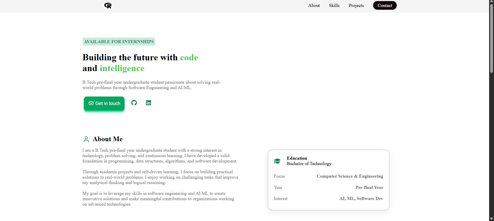

# 🚀 Personal Portfolio

A modern and responsive developer portfolio showcasing my projects, skills, and experience.  
Built with React, TypeScript, and Vite.

---

## 🌐 Live Demo
👉 https://portfolio-omega-rust-52vw941xk5.vercel.app/
---

## 🖼️ Preview


---

## ✨ Features
- Responsive design (mobile friendly)
- Modern UI/UX
- Smooth scrolling navigation
- Projects showcase section
- Skills section
- Contact section
- Social media links

---

## 🛠️ Tech Stack
- React
- TypeScript
- Vite
- CSS
- FontAwesome

---

## 📁 Project Structure
```text
Portfolio
├─ src
├─ public
├─ components
├─ package.json
└─ vite.config.ts
```
---

## ⚙️ Installation

Clone the repository:
```bash
https://github.com/Rsccpp/Portfolio.git
```
Install dependencies:
```bash
npm install
```
Run development server:
```bash
npm run dev
```
